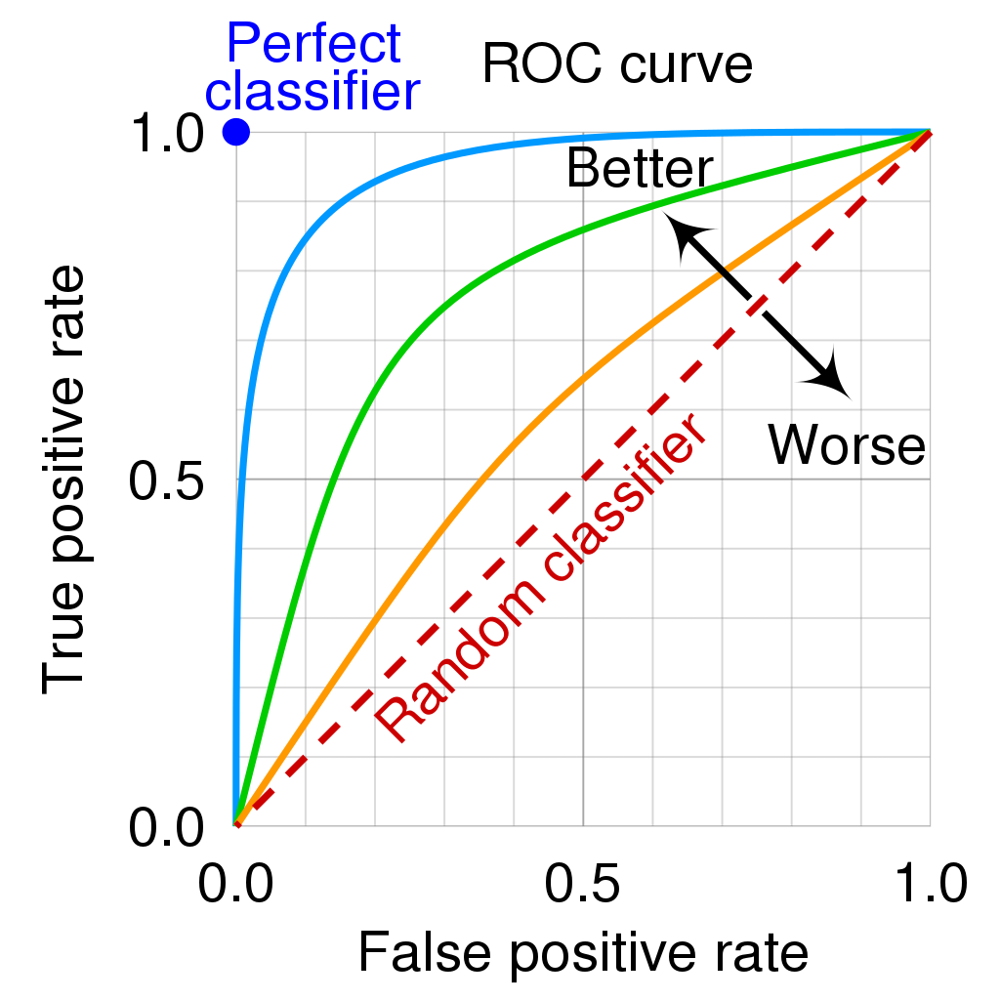

---
jupytext:
  formats: md:myst
  text_representation:
    extension: .md
    format_name: myst
kernelspec:
  display_name: Python 3
  language: python
  name: python3
---

# Introduction to Scikit-learn 
  - Choose the right estimator -- the right algorithm for doing ML
    - https://scikit-learn.org/stable/tutorial/machine_learning_map/index.html
  - Consistent -- all object share a common interface
  - Inspection -- all parameter values are exposed as public attributes
  - Limited object Hierarchy -- algorithms are represented as Python classes, datasets mainly as numpy array and parameters as standard python strings 
  - Composition -- ML as a sequences of fundamental algorithms
  - Defaults -- provides good default values

## High Level Steps
  - Choose the class of model to be coded
  - Choose the hyper parameters of the model
  - Arrange data into target and features
  - Write model fitment code using fit() method. 

## General Steps
  - Load Data
    - Three ways load data
      - Dataset loaders (toy datasets that come with skikit-learn)
        - Good for illustrating how the various algorithms work
      - Dataset fetchers (real world datasets)
        - Built-in functions to load large datasets
        - Pull from openml.org
      - Dataset generation functions
        - Artificial datasets -- can create labeled datasets
        - 
  - Pre-process Data
    - Remove mean **
    - Scale Variance **
    - Non-linear transformation
    - Normalization
    - Encoding categorical features
    - Discretization
    - Imputation of missing values 
    - Maybe remove outliers if it can be justified. Always document this in research paper

## Loading data

## Preprocessing

### Mean and Variance
- algorithms require that all the features have variance of similar magnitude. If the magnitude differ by orders of magnitude larger than others, it might dominate the objective function.
  - Whatever mean or std you subtract from the training set, you have to use the same on the testing set. 
- Algorithms assume that the input data is Gaussian distribution with zero mean and unit variance. 
- Power transformers aim to map data from any distribution to as close to a Gaussian distribution 

### Encoding
- Map text values to integer codes. For example, instead of using text for city names, use integers, or Male = 0, Female = 1. This allows fitting numerical values into models. 

### Discretization 
- Turn continuous values in to discrete values. You bin the continuous into bins. *** Linear models can become non-linear due to discretization 

### Imputation 
- Many real world datasets contain missing values; 
  - Discard entire rows
  - Or fill data -- usually by guessing from available data

## Splitting Data
- It is common to split data into training and testing samples. 
- Usually you do 90/10 or 80/20. 
- The splitting has to be random
- K-Cross-fold validation -- split data K times

## Linear Regression
- LR models the relationship between a dependent variable and one or more independent variable. When one increase or decrease, the other increases or decreases. 

## Naive Bayes
- Simple supervised machine learning classifier
- Assumes the features are independent 
  - Example -- apple is red, round and 4 cm in diameter 

## Support Vector Machine (SVM)
- Another supervised machine learning classifier
  - use for both classification and regression 
- Can do non-linear classification
- Hyper plane -- maximize the margin between two classes
- Support Vectors -- data points that define the hyper plane 
- Margin width -- define an optimal hyper plane we need to maximize the width
of the margin 

## Evaluation 
Ref: https://en.wikipedia.org/wiki/Receiver_operating_characteristic
Ref: https://datascience-enthusiast.com/Python/ROC_Precision-Recall.html

